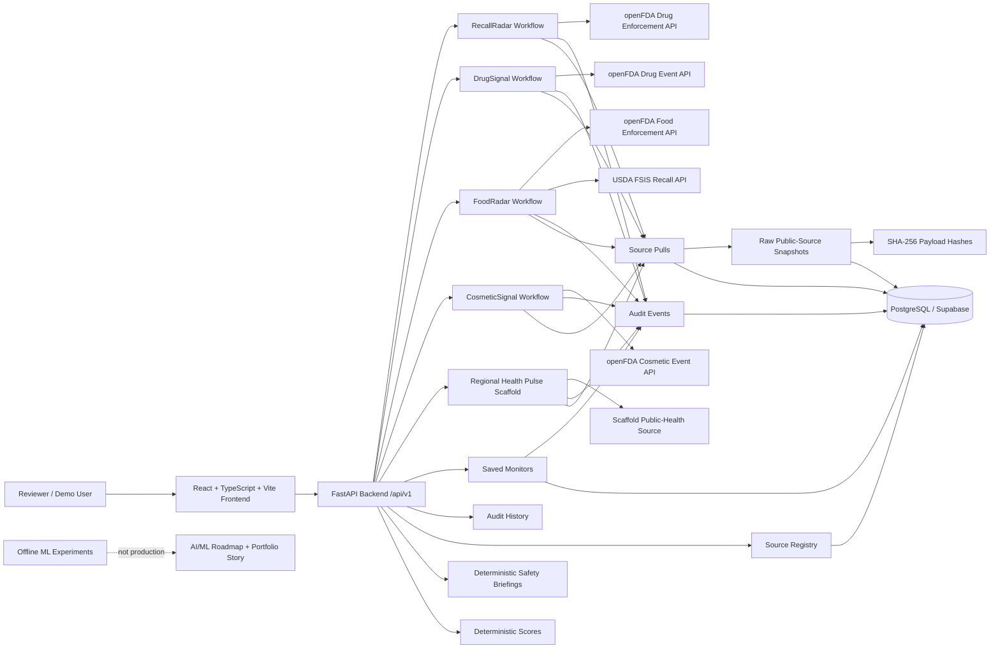

# DAV AI Current Architecture Overview

Date: June 2026  
Status: Current portfolio MVP architecture summary

DAV AI is a public-data healthcare and everyday safety intelligence prototype. It is designed to help reviewers search, score, audit, brief, monitor, and compare public safety signals from trusted public sources.

DAV AI is not production healthcare software. It is not medical advice, not diagnosis, not treatment guidance, not clinical decision support, and not a medical device. It does not use PHI or private patient records.

## Current Product Identity

The active project name is **DAV AI**.

Older planning materials may reference prior project names. Treat those names as historical proposal or planning context. The current repository and portfolio identity should use DAV AI.

## Implemented Today

- React, TypeScript, and Vite frontend.
- FastAPI backend.
- RecallRadar search using openFDA Drug Enforcement public data.
- DrugSignal search using openFDA Drug Event public data.
- FoodRadar search using openFDA Food Enforcement public data plus USDA FSIS recall and public-health-alert data for meat, poultry, and egg-product coverage.
- CosmeticSignal search using openFDA Cosmetic Event public data.
- Regional Health Pulse MVP scaffold for public-health signal workflow design.
- Source Registry and Data Sources visibility.
- Audit History for public-data traceability.
- Source-pull provenance records.
- Raw public-source snapshot persistence where supported.
- Stable SHA-256 payload hashing for reproducibility and change review.
- Deterministic Recall Review Score and DrugSignal intelligence outputs.
- Deterministic FoodRadar review-priority scoring and CosmeticSignal reporting-signal scoring.
- Deterministic semantic similarity previews in RecallRadar and DrugSignal API responses.
- Deterministic role-based safety briefings.
- Saved Monitors manual workflow for repeatable public-data searches.
- Saved-monitor manual run history and latest/previous comparison.
- Backend scheduled-refresh foundation and CLI guardrails.
- Database-backed scheduler lock foundation.
- Offline ML experiments under `backend/ml_experiments`.
- Backend and frontend automated test coverage.

## Partial / Scaffold

- Regional Health Pulse is a scaffolded MVP workflow. It is not live CDC/HHS surveillance, not outbreak detection, not emergency guidance, and not personal disease-risk prediction.
- FoodRadar is public recall/public-health-alert review only. A missing match does not prove that a food, supplement, meat, poultry, egg, or packaged product is safe or unsafe.
- CosmeticSignal is public cosmetic adverse-event report review only. Cosmetic adverse-event reports do not prove causation and may be incomplete, duplicated, delayed, or influenced by reporting behavior.
- Saved Monitors support manual review and backend scheduling groundwork, but they are not production alerting.
- Scheduler logic and Render Cron planning exist, but production Cron activation is not enabled.
- Semantic similarity previews use deterministic public-data text similarity only. They are not production ML, RAG, LLM output, alerting, clinical decision support, diagnostic output, care guidance, or medical advice.
- Offline ML experiments exist for responsible AI/ML framing, but no production ML model is deployed in the API, frontend, scheduler, saved-monitor workflows, or alerts.

## Planned / Future Work

- Authentication and role-based access control.
- User ownership for saved monitors and audit records.
- Production Cron activation.
- Public scheduling UI.
- Notification preferences.
- Automated alert delivery.
- Production scheduler observability.
- Live CDC/HHS-backed Regional Health Pulse connectors.
- Briefing persistence/history.
- Source-grounded RAG or LLM briefing assistant after retrieval, citation, and guardrail evaluation mature.
- Semantic search after source grounding and evaluation are stronger.
- CNN/OCR label scanner as a later optional feature, not a current MVP priority.

## Not Implemented

DAV AI does not currently include:

- Production healthcare operations readiness.
- Clinical decision support.
- Diagnosis, treatment, medication-change, or causality guidance.
- PHI storage.
- Real user accounts or RBAC.
- Production alerting.
- Production ML.
- LLM/RAG assistant.
- CNN/OCR product-label scanning.
- Live outbreak surveillance.

## High-Level Architecture

## Latest Verification Evidence

Latest confirmed verification evidence:

- Backend tests: 260 passed.
- Frontend tests: 70 passed.
- Frontend lint: passed.
- Frontend production build: passed.
- Deployment smoke should be re-run after current FoodRadar/CosmeticSignal documentation and any hosted app changes before claiming current deployed readiness.
- Live smoke tests confirmed `semantic_preview` appears in both `/api/v1/recalls/search` and `/api/v1/drug-events/search`.
- Recent current-state documentation improvements: README/docs now include FoodRadar, CosmeticSignal, expanded public data sources, updated safety boundaries, and current verification results.

This verification supports DAV AI's current portfolio MVP quality posture. It does not make DAV AI production healthcare software, clinical decision support, or medical advice.
