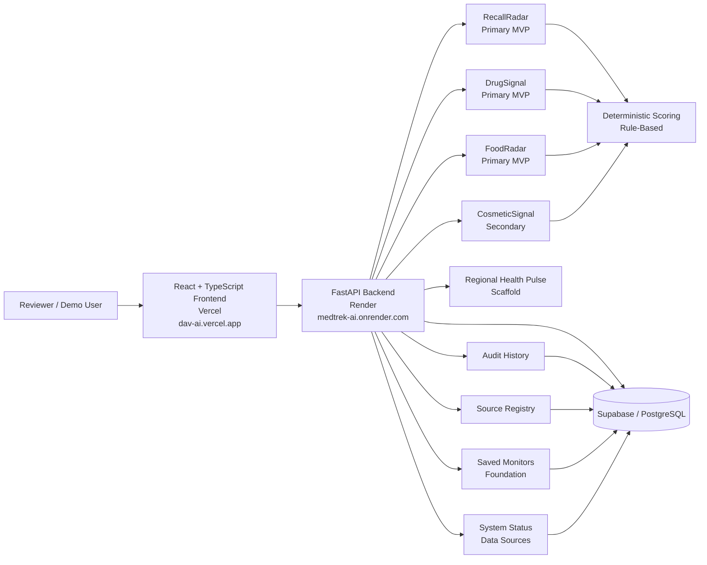
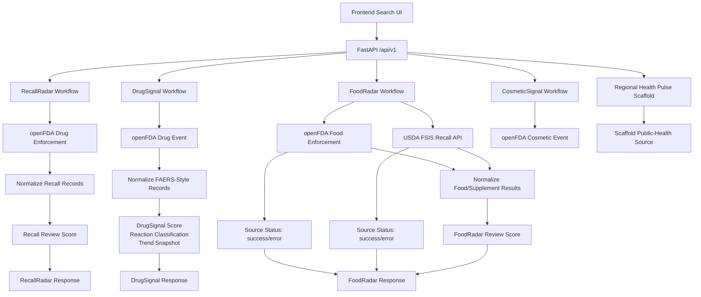
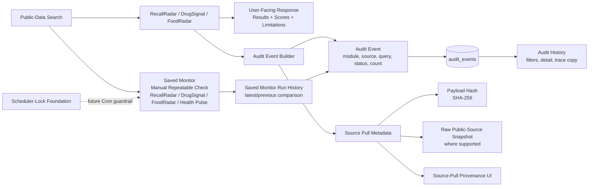

# DAV AI Final Portfolio Architecture

## 1. Title and Status

Status: current portfolio MVP architecture, verified for interview and portfolio discussion.

DAV AI is a public-data healthcare and everyday safety intelligence workspace. The current primary MVP story is:

```text
RecallRadar -> DrugSignal -> FoodRadar
```

This architecture document describes the current verified MVP, not a production healthcare system and not a production ML system.

Verified deployment URLs:

- Frontend: `https://dav-ai.vercel.app`
- Backend: `https://medtrek-ai.onrender.com`

Verified quality gates:

- Backend tests: 263 passed
- Frontend tests: 70 passed
- Frontend lint: passed
- Frontend production build: passed

## 2. High-Level Architecture Summary

DAV AI uses a React + TypeScript frontend deployed on Vercel, a FastAPI backend deployed on Render, and Supabase/PostgreSQL for persistence.

The primary product path is built around three source-grounded review workflows:

- RecallRadar: public drug recall review from openFDA Drug Enforcement.
- DrugSignal: public adverse-event reporting-pattern review from openFDA Drug Event.
- FoodRadar: public food/supplement/meat/poultry/egg-product recall and public-health-alert review from openFDA Food Enforcement plus USDA FSIS Recall API coverage.

Secondary and extension surfaces support the platform story without becoming the main demo path:

- CosmeticSignal
- Regional Health Pulse scaffold
- Saved Monitors, including manual FoodRadar monitor create/run/history support
- Data Sources
- System Status
- Audit History
- Source Registry
- source freshness
- source-pull provenance
- scheduler-lock foundation

The most important architectural choice is that intelligence remains deterministic and rule-based in the current MVP. Production ML, RAG/LLM behavior, OCR/CNN scanning, ProductScan, alert delivery, auth/RBAC, production Cron activation, and live CDC/HHS-backed Regional Health Pulse connectors are intentionally outside the current MVP.

## 3. Primary MVP User Flow

The interview/demo flow should start with the safety boundary, then walk through the primary MVP path:

1. RecallRadar: search a public recall term, review normalized recall cards, inspect review-priority score, source metadata, audit context, and safety limitations.
2. DrugSignal: search a drug term, review public adverse-event reporting patterns, deterministic scoring, reaction classification, trend context, source metadata, and FAERS causation disclaimers.
3. FoodRadar: search `chicken` or another everyday food/supplement term, review multi-source source status, fail-soft behavior, matching public recall card, review score, audit metadata, and source limitations.

After the primary path is clear, secondary surfaces can be shown as support:

- Audit History for traceability.
- Data Sources and System Status for operational transparency.
- Saved Monitors for repeatable public-data checks, including manual FoodRadar monitor create/run/history support.
- CosmeticSignal as a secondary public cosmetic adverse-event extension.
- Regional Health Pulse as a scaffolded architecture extension only.

## 4. System Architecture Diagram Using Mermaid



This diagram shows the current product hierarchy: RecallRadar, DrugSignal, and FoodRadar are the main MVP path; CosmeticSignal, Health Pulse, Saved Monitors, Data Sources, System Status, Audit History, and Source Registry support the platform story.

## 5. Data/Source Flow Diagram Using Mermaid



FoodRadar supports fail-soft multi-source behavior. If one source errors, available source results can still render with source status. The deployed `chicken` smoke verification confirmed openFDA Food Enforcement success while USDA FSIS was marked error, with the FoodRadar result still rendering.

## 6. Audit/Provenance Flow Diagram Using Mermaid



Audit History, source registry, source freshness, source-pull provenance, payload hashes, and saved-monitor foundations support traceability and operational transparency. They are part of the trust layer that should come before production ML, alerting, or user-specific workflows.

## 7. Deployment Architecture

Current verified deployment:

- Frontend: React + TypeScript on Vercel at `https://dav-ai.vercel.app`
- Backend: FastAPI on Render at `https://medtrek-ai.onrender.com`
- Database: Supabase/PostgreSQL
- Public data sources: openFDA and USDA FSIS APIs, plus scaffold source metadata for Regional Health Pulse

Deployment responsibilities:

- Vercel serves the public frontend and routes browser API requests to the configured backend URL.
- Render serves the FastAPI backend, public `/api/v1` routes, health/status endpoints, source registry, search workflows, audit history, saved monitors, and system/data-quality surfaces.
- Supabase/PostgreSQL stores audit events, source registry metadata, source-pull metadata, saved-monitor definitions, FoodRadar manual monitor runs, run history, scheduler-lock state, and related persistence records where configured.

## 8. Safety and Responsible-AI Boundaries

DAV AI is not:

- medical advice
- diagnosis
- treatment guidance
- clinical decision support
- proof of causation
- an official product-safety verdict
- a medical device
- a replacement for FDA, USDA, CDC, clinicians, pharmacists, emergency services, or official source guidance

Current MVP boundaries:

- DAV AI uses public data only.
- DAV AI does not store PHI.
- DAV AI does not use private patient records, diagnosis history, prescription history, insurance data, personal health workflows, or private medical narratives.
- FAERS-style adverse-event reports do not prove causation or incidence.
- Cosmetic adverse-event reports do not prove causation.
- A missing public-data result does not prove that a product is safe or unsafe.
- Regional Health Pulse is a scaffold/architecture extension, not live CDC/HHS surveillance, outbreak detection, emergency guidance, or personal disease-risk prediction.

Responsible-AI posture:

- Current intelligence is deterministic and rule-based.
- Production ML is not deployed in the API, frontend, scheduler, saved-monitor workflows, or alerts.
- RAG/LLM features are not part of the current MVP.
- OCR/CNN scanning and ProductScan are not part of the current MVP.
- The architecture prioritizes source transparency, auditability, reproducible public-source pulls, and clear limitation language before predictive or generative AI.

## 9. Current Verified Endpoints and Deployment URLs

Verified deployment URLs:

- Frontend: `https://dav-ai.vercel.app`
- Backend: `https://medtrek-ai.onrender.com`

Verified backend smoke coverage:

- `GET /api/v1/system/status` returned 200.
- API status was ok.
- Database was configured.
- Audit history was readable.
- Source registry reported 7 sources.
- `GET /api/v1/everyday-safety/search?q=chicken&category=food_supplement&limit=5` returned 200 with FoodRadar audit metadata.
- FoodRadar fail-soft behavior worked: openFDA Food Enforcement succeeded while USDA FSIS was marked error.

Verified frontend smoke coverage:

- Sources page loaded and showed 7 sources.
- System page loaded API ok, database configured, audit readable, and 7 sources.
- FoodRadar search for `chicken` rendered 1 matching public food/supplement recall record.
- FoodRadar displayed openFDA Food Enforcement success with 23 source records.
- FoodRadar displayed USDA FSIS error with 0 records.
- FoodRadar result card rendered review score 32 / Moderate.

Core current API areas:

- `GET /health`
- `GET /api/v1/system/status`
- `GET /api/v1/system/data-quality`
- `GET /api/v1/sources`
- `GET /api/v1/recalls/search`
- `GET /api/v1/drug-events/search`
- `GET /api/v1/everyday-safety/search`
- `GET /api/v1/cosmetic-events/search`
- `GET /api/v1/audit-events`
- `GET /api/v1/audit-events/{audit_id}`
- `GET /api/v1/audit-events/{audit_id}/source-pull`
- `GET /api/v1/saved-monitors`
- `POST /api/v1/saved-monitors`
- `POST /api/v1/saved-monitors/{monitor_id}/run`
- `GET /api/v1/saved-monitors/{monitor_id}/runs`

## 10. What Is Intentionally Not in the Current MVP

The current MVP does not include:

- ProductScan
- OCR/CNN label scanning
- personal health data workflows
- production ML
- RAG/LLM features
- auth/RBAC
- alert delivery
- production Cron activation, including scheduled FoodRadar monitor refresh
- live CDC/HHS-backed Regional Health Pulse connectors
- clinical decision support
- PHI storage
- official product-safety verdicts
- patient-specific risk prediction
- outbreak detection

These are future work items or explicit non-goals. They should not be claimed in portfolio discussion as implemented production capabilities.

## 11. Interview Talking Points

Use this architecture story in interviews:

- The primary MVP path is deliberately focused: RecallRadar, DrugSignal, and FoodRadar.
- The system uses a repeatable pattern across public-data domains: search, normalize, score, audit, explain, and preserve source limitations.
- FoodRadar demonstrates multi-source public-data integration and fail-soft source behavior, which is a stronger engineering signal than a single happy-path API call.
- Audit History, Source Registry, source freshness, source-pull provenance, payload hashes, and saved-monitor history form the trust layer.
- The project avoids unsafe healthcare claims: it does not diagnose, recommend treatment, prove causation, or replace official guidance.
- Current intelligence is deterministic and explainable by design; production ML, RAG, LLM, OCR, and alerting remain off until the source, audit, evaluation, and safety foundations are stronger.
- The deployment is real and verified: React/TypeScript on Vercel, FastAPI on Render, Supabase/PostgreSQL persistence, and passing quality gates.
- The strongest responsible-AI decision is restraint: DAV AI builds public-data traceability and governance before adding predictive or generative AI.
